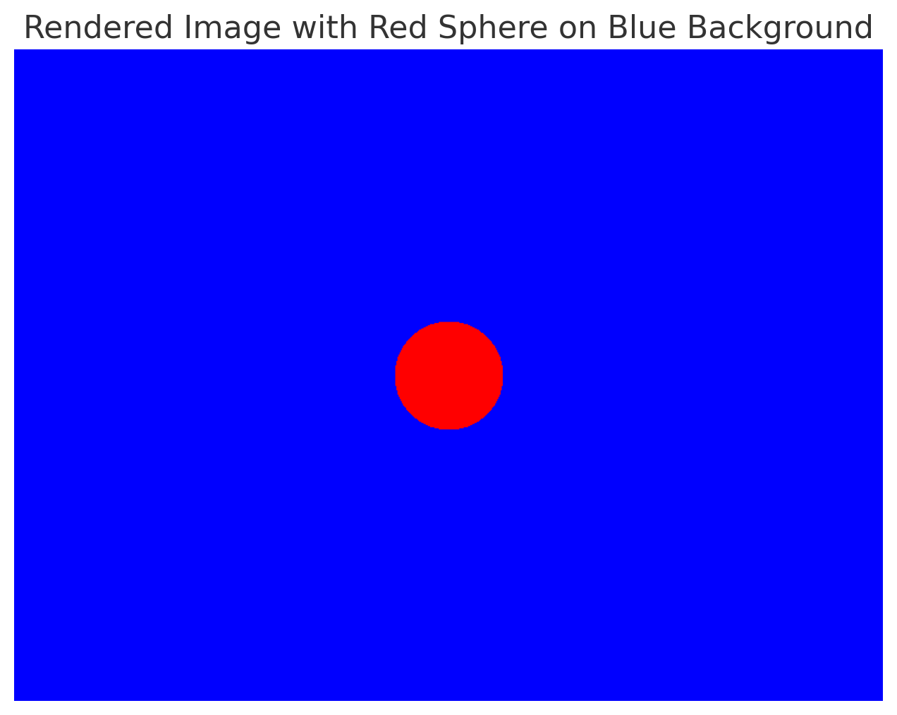

# Parallel Ray Tracing for 3D Rendering using CUDA

## Overview

This project implements a parallel ray tracing algorithm using CUDA to enhance 3D rendering performance. Ray tracing is a sophisticated computational technique that simulates the behavior of light rays as they interact with various objects, producing high-quality and realistic images. By leveraging the power of GPU parallel processing, this project aims to significantly reduce rendering times compared to traditional CPU-based methods.

## Background

Ray tracing is widely used in computer graphics to generate photorealistic images by simulating the way light behaves in the real world. The process involves tracing the path of rays from the camera through the scene, detecting intersections with objects, and calculating the color of pixels based on light interactions. However, due to the computational intensity of ray tracing, rendering can be time-consuming, especially for complex scenes. CUDA (Compute Unified Device Architecture) provides a powerful framework for parallel computing on NVIDIA GPUs, allowing us to distribute the workload of ray tracing across multiple threads for faster processing.

## Project Structure and File Organization

The following is the structure of the project files:

```
/ParallelRayTracing
│
├── main.cu             # Main CUDA file where the ray tracing algorithm is implemented.
├── scene.h             # Header file containing definitions for the scene setup, including objects and materials.
├── scene.cu            # CUDA file that initializes the scene with objects like spheres and planes.
├── ray.h               # Header file defining the Ray class and related functions.
├── ray.cu              # CUDA file implementing the ray operations.
├── camera.h            # Header file defining the Camera class.
├── camera.cu           # CUDA file implementing camera operations, including ray generation.
├── material.h          # Header file defining materials for objects (e.g., reflective, diffuse).
└── Makefile            # Makefile to compile all CUDA and C++ files into an executable.
```

## Implementation

### 1. Main Algorithm (`main.cu`)
The core of the ray tracing logic is implemented here. The main file initializes the GPU, allocates memory for scene objects, and launches the kernel for ray tracing.

### 2. Scene Setup (`scene.h` and `scene.cu`)
This module is responsible for defining the 3D scene. The scene can include various objects (e.g., spheres, planes) and their respective materials. The `scene.cu` file initializes these objects and their properties.

### 3. Ray Operations (`ray.h` and `ray.cu`)
This section defines the `Ray` class and essential operations, such as ray-object intersection tests. The ray operations are crucial for determining how light interacts with objects in the scene.

### 4. Camera Operations (`camera.h` and `camera.cu`)
The camera module generates rays based on the camera's position and orientation. It computes the rays that will be traced into the scene to create the final image.

### 5. Material Behavior (`material.h`)
Materials define how objects reflect or absorb light. This module implements the behavior of different materials, such as diffuse and reflective surfaces, to achieve realistic shading effects.

### 6. Build Process (`Makefile`)
The provided Makefile facilitates the compilation of all source files, linking necessary libraries and generating the final executable.

## Prerequisites

- CUDA Toolkit (compatible version)
- NVIDIA GPU with CUDA support
- C++ Compiler

## Getting Started

1. **Clone the repository**:
   ```bash
   git clone <repository-url>
   cd ParallelRayTracing
   ```

2. **Compile the project**:
   ```bash
   make
   ```

3. **Run the executable**:
   ```bash
   ./ray_tracer
   ```

## Conclusion

This project demonstrates the efficiency of parallel processing in rendering complex 3D scenes using ray tracing. Future improvements could include implementing more advanced lighting techniques, such as global illumination or motion blur, to enhance the realism of rendered images.


